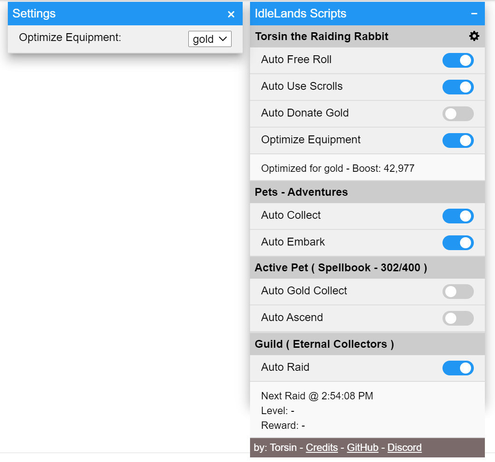

# idleLands-automation
Automation script for IdleLands
https://play.idle.land/

A big thank you to `Sarimash` for showing my some example code he created, which evolved to this... 

# To Use
Download a userscript manager like [tampermonkey](https://www.tampermonkey.net/) or [greasemonkey](https://www.greasespot.net/)  
Import the script  
Once logged into IdleLands, you will see a window on the top right corner.
- You can drag the window anywhere on the screen by clicking and holding the title bar
- You can minimize the window by clicking the "-" sign on the to right corner of the window
- You can change options via the cog icon beside you character name
- Also, all options are saved in storage for persistence

# Features
- auto free roll (daily)
- auto use scrolls/buffs
- auto donate gold
- optimize equipment by gold or XP
- Pet Adventures
  - auto collect adventures when completed
  - auto send your pets on adventures
- Active Pet
  - auto gold collect (request from Anten)
  - and auto ascend (request from Anten) (checks for materials and if pet is maxed out)
- Raids
  - auto raiding, must be a guild leader or mod to use this feature
- Options Window
  - Change the equipment optimization
  
# Credits
- `Anten`
- `Sarimash`

# Todo
- Better raid boss picking based needs in an array
- Auto pet ability usage (request from `Anten`)
- Implement auto by pots, code provided by `Sarimash`
- Implement reroll quests, code provided by `Sarimash`
- Other automations gamble? leave party?
- You have an idea/suggestion, please ask away
